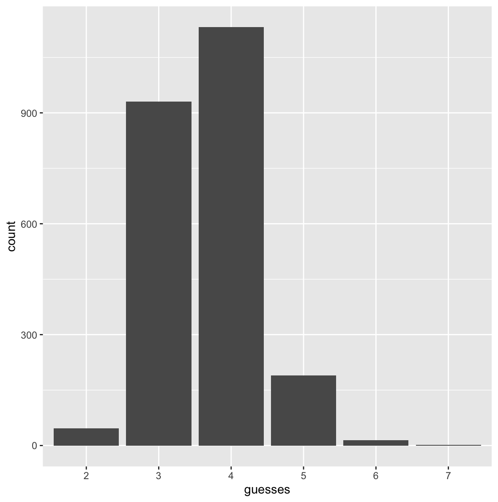

# wordle_solver

This is my attempt at building a simple wordle solver in R.

[wordle](https://www.nytimes.com/games/wordle/index.html)

## Set up (set_up.R)

This script imports the word lists and sets up some base functions. Two wordle word lists are available:

* 'allowed' - which is the list of all allowed guesses, not including answers (~12,000 words)

* 'answers' - all wordle solutions, past and future (2,315 words) 

This script combines these into a master list of words - which I call `words`. I also keep the `answers` separate for testing the solvers and for use in the 'cheating' solver. 

The functions in `set_up` are as follows:

* simulate_results -> outputs a string of 'results' (ie a 5 character strings of either G - greens, O - oranges or N - greys) for a given word and solution. E.g. 'GNGOG' indicates green result for the first, third and fifth letter, orange for the fourth and grey for the second.

* trim_word_list -> reduces the solution space (i.e. list of ~12,000 words in the wordle dictionary) based on results provided in the string format described above. For `entropy_solver_cheat`, only words in the `answers` list are considered and trimmed by this function. More on that later.

These functions currently handle duplicate characters slightly differently to wordle. Consider the guess 'EATER' and the true answer 'EARNT'. Wordle would return 'GGONO' with a grey result for the second 'E' in the guess, because the only E in the solution has been identified. These functions would show the second 'E' in this guess as having an orange result, e.g. 'GGOOO'.

## Entropy solver (entropy_solver.R)

### Usage

The entropy solver contains a simulation tool (function: `entropy`) which can be used to simulate the solver's guesses for a given starting guess and answer. 

It also contains a live solver (function: `live_entropy_solver`), where the user can manually input results into the R console and receive suggested guesses without the function 'knowing' the answer.

### Method

Inspired by [https://aditya-sengupta.github.io/coding/2022/01/13/wordle.html](https://aditya-sengupta.github.io/coding/2022/01/13/wordle.html)

This solver uses Shannon entropy to choose the next word [link](https://en.wikipedia.org/wiki/Entropy_(information_theory)).

Every possible word in the word list (all 12,000ish) is considered as a possible guess, and we maximise differential entropy to select the best word. 

What does that mean in practice? Well, we want to choose a word that has the highest potential to reduce the possible solution space. Essentially, this means we seek guesses which maximise the number of possible greens and oranges on the solution space. 

For a given solution space, we loop through every possible word in the word list and, for each letter in the word, we calculate three scores :

* **Green score** - the number of times the letter in the word aligns exactly with a word in the solution space, if it was not previously known to be in the solution (~chance of a new green)

* **Orange score** - the number of times the letter in the word appears in a solution space word, if it was not previously known to be in the solution. (~chance of a new orange)

* **Grey score** - number of times a letter does not do either of the two above (Grey score = (No. of words*no. of letters) - Green score - Orange score)

We then calculate the entropy of this distribution of scores. And sum this for each letter within a word. The word with the highest entropy is chosen as the next guess, and the solution space then restricted based on the results of this guess. As mentioned above, a list of 2,315 wordle answers is available and some solvers use this list as the possible solution space. This, unsurprisingly, results in a solver with better performance than the approach taken here. But I think that feels a bit too much like cheating, so this solver considers **every** word in the wordle dictionary as a possible solution.

**Intuition for entropy maximisation**. As 'Greys' are far more likely that 'Greens' or 'Oranges' in general, selecting words which maximise this differential entropy is roughly equivalent to maximising the number of new 'Greens' and 'Oranges'.

For example, if there were 10 words remaining, the scores for two possible words might be something like: [green-score,orange-score,grey-score] = [1,1,48]  and  [0,3,47]

The word with scores `[0,3,47]` has the higher entropy, and so would be the preferred guess. In simple terms, this is because it has the potential to  provide 3 oranges, compared to 1 green and 1 orange for the other case. 

**Note** - if there are only two valid words left in the solution space, the solver randomly picks one. Consider the following case, which shows the results for solution 'POINT' if the solver does not have this tweak:

SOARE

LINTY

NOINT

JAAPS

POINT

Without this change, the solver guesses JAAPS to determine whether the final solution is POINT or JOINT. But it would be a better strategy to just guess one of POINT or JOINT as then you have a chance of getting the answer in 4 guesses.

### Cheat version (entropy_solver_cheat.R)

This solver takes the exact same approach as before, except the solution space which is reduced after each guess, is limited to **just the 2,315 answers**. The solver still considers all possible words in the total word list as possible guesses, and chooses the word which will result in the maximum entropy increase with respect to the solution space of answers.

This is a same approach to lots of solvers out on the web. But I think the non-cheat version is more interesting as it more closely aligns with the reality of what a player faces: a player doesn't know what's in the list of answers and so is just aiming to reduce the solution space of **all possible words** when making their guesses.

## String distance solver (simple_solver.R)

### Usage

The simple_solver contains a simulation tool (function: `simple_solver`) which can be used to simulate the solver's guesses for a given starting guess and answer. 

It also contains a live solver (function: `live_simple_solver`), where the user can manually input results into the R console and receive suggested guesses without the function 'knowing' the answer.

### Method

This solver uses the `stringdist` [package](https://cran.r-project.org/web/packages/stringdist/stringdist.pdf) in R to choose new guesses. 

This solver takes a string distance approach. This is based on the (not particularly well thought-through) logic that we want to maximise the information gain of each guess. And the similarity of a given word to all other words in the solution space is a proxy for this. 

The total string distance for a word in the possible solution space is calculated by summing over the string distance between that word and every other possible word in the solution space.

The word from the solution space with the minimum total string distance is suggested as the next guess.

Given that this only considers possible legitimate answers as guesses (rather than the full word list), this performs reasonably well.

## Performance

The relative performance of each solver is tested by running the solver on every answer in the wordle answer list and recording how many guesses it took (`testing.R`).

### Entropy solver
If using 'SOARE' as the starting word (best starting guess suggested by the model) the solver averaged 4.25 guesses with a 99.7% success rate. Fails on the following 7 words:

* baker
* caper
* fight
* maker
* tight
* wacky
* wreak

### Entropy solver cheat
If using 'SOARE' as the starting word, the solver averaged 3.65 guesses with a 99.9% success rate. Fails on the following 2 words:

* taunt
* vaunt

### Simple solver (using string distance)
If using 'SORES' (best starting guess suggested by the model), the solver averaged 5.23 guesses with an 84% success rate.

## Word list
This was taken from [here](https://gist.github.com/cfreshman). Credit to [github.com/cfreshman](https://github.com/cfreshman).
